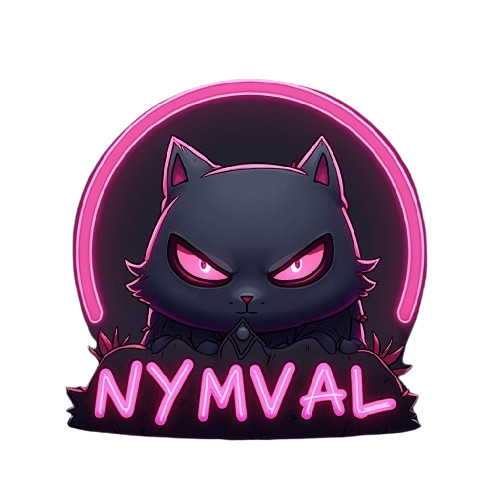

<div align="center">
  
</div>

# Nymval AI - Modern Chat Application

<div align="center">
  <a href="https://reactjs.org/">
    
  </a>
  <a href="https://www.typescriptlang.org/">
    
  </a>
  <a href="https://supabase.com/">
    
  </a>
  <a href="https://tailwindcss.com/">
    
  </a>
</div>

## Overview

Nymval AI is a modern chat application designed to provide an exceptional real-time communication experience. It allows users to chat with two AI models simultaneously, offering diverse perspectives in conversations. The app also includes features for storing chat history for future reference or deleting conversations to maintain privacy. Built with React, TypeScript, and Supabase, Nymval AI combines cutting-edge technologies with a sleek and responsive user interface to deliver a seamless and secure chat experience.

## Table of Contents

1. [Features](#features)
2. [Tech Stack](#tech-stack)
   - [Frontend](#frontend)
   - [Backend & Services](#backend--services)
   - [Other Tools](#other-tools)
3. [Getting Started](#getting-started)
   - [Prerequisites](#prerequisites)
   - [Installation](#installation)
4. [Deployment on Netlify](#deployment-on-netlify)
5. [Development](#development)
   - [Available Scripts](#available-scripts)
   - [Project Structure](#project-structure)
6. [Contributing](#contributing)
7. [License](#license)

---

## Features

- 🔐 User Authentication with Supabase
- 💬 Real-time Chat Functionality
- 🎨 Modern UI with shadcn/ui Components
- 🌙 Dark Mode Support
- 📱 Responsive Design
- 🚀 Fast Development with Vite
- 🔍 Type Safety with TypeScript

## Tech Stack

### Frontend

| Technology          | Description                        | Icon                                                                                                                                                                  |
| ------------------- | ---------------------------------- | --------------------------------------------------------------------------------------------------------------------------------------------------------------------- |
| **React 18**        | Component-based UI library         | [](https://reactjs.org/)                                            |
| **TypeScript**      | Type safety and better DX          | [](https://www.typescriptlang.org/)                  |
| **Vite**            | Build tool and dev server          | [](https://vitejs.dev/)                                                |
| **React Router**    | Client-side routing                | [](https://reactrouter.com/)                 |
| **TanStack Query**  | Data fetching and state management | [](https://tanstack.com/query)           |
| **Tailwind CSS**    | Utility-first CSS framework        | [](https://tailwindcss.com/)                 |
| **shadcn/ui**       | Prebuilt UI components             | [](https://ui.shadcn.dev/)                               |
| **Radix UI**        | Accessible component primitives    | [](https://www.radix-ui.com/)                            |
| **Lucide React**    | Icon library                       | [](https://lucide.dev/)                                 |
| **React Hook Form** | Simplified form management         | [](https://react-hook-form.com/) |
| **Zod**             | Schema validation                  | [](https://zod.dev/)                                                     |

### Backend & Services

| Technology   | Description                 | Icon                                                                                                                                  |
| ------------ | --------------------------- | ------------------------------------------------------------------------------------------------------------------------------------- |
| **Supabase** | Backend as a Service (BaaS) | [](https://supabase.com/) |

### Other Tools

| Technology  | Description              | Icon                                                                                                                                  |
| ----------- | ------------------------ | ------------------------------------------------------------------------------------------------------------------------------------- |
| **ESLint**  | Linting and code quality | [](https://eslint.org/)         |
| **PostCSS** | CSS processing           | [](https://postcss.org/)     |
| **Netlify** | Deployment and hosting   | [](https://www.netlify.com/) |

## Getting Started

### Prerequisites

- Node.js (v18 or higher)
- npm or yarn package manager

### Installation

1. Clone the repository

```bash
git clone <https://github.com/ninja225/Nymval.git>
```

2. Install dependencies

```bash
npm install
# or
yarn install
```

3. Create a `.env` file in the root directory and add your Supabase credentials:

```env
VITE_SUPABASE_URL=your_supabase_project_url
VITE_SUPABASE_ANON_KEY=your_supabase_anon_key
```

4. Start the development server

```bash
npm run dev
# or
yarn dev
```

The application will be available at `http://localhost:8080`

## Deployment on Netlify

1. Push your code to a Git repository (GitHub, GitLab, or Bitbucket)

2. Log in to your Netlify account and click "New site from Git"

3. Choose your repository and configure the build settings:

   - Build Command: `npm run build`
   - Publish Directory: `dist`

4. Add environment variables in Netlify's dashboard:

   - Go to Site Settings > Build & Deploy > Environment
   - Add the same environment variables from your `.env` file

5. Deploy! Netlify will automatically build and deploy your site

## Development

### Available Scripts

- `npm run dev` - Start development server
- `npm run build` - Build for production
- `npm run preview` - Preview production build locally
- `npm run lint` - Run ESLint

### Project Structure

```
src/
  ├── components/     # Reusable UI components
  ├── contexts/       # React contexts
  ├── hooks/          # Custom React hooks
  ├── integrations/   # Third-party service integrations
  ├── lib/            # Utility functions
  ├── pages/          # Page components
  ├── services/       # API and business logic
  └── types/          # TypeScript type definitions
```

## Contributing

Contributions are welcome! Please feel free to submit a Pull Request.

## License

This project is licensed under the MIT License - see the LICENSE file for details.
